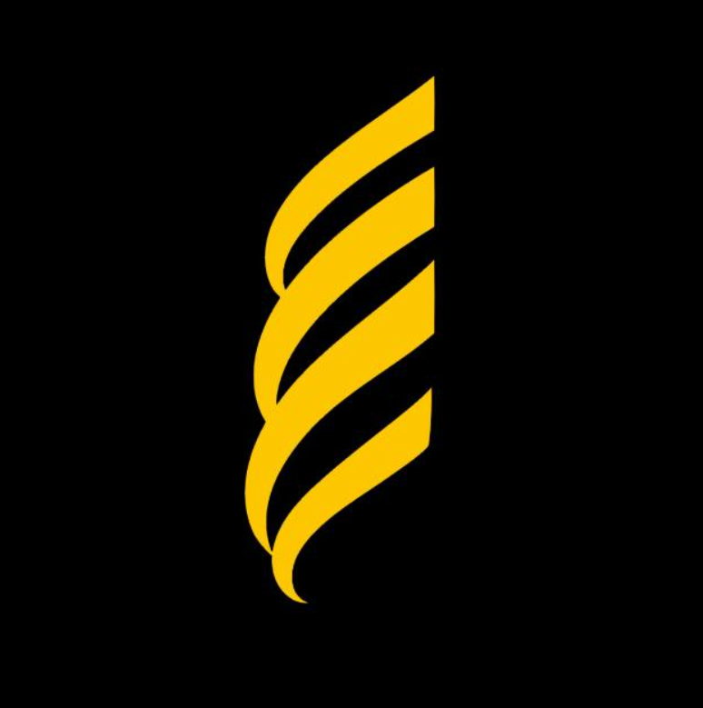

**Este projeto foi desenvolvido como uma fase do processo seletivo do Grupo Optimus, realizado de 19 de abril até 25 de abril de 2024. 

# Projeto Fullstack To-do-List

<!-- Substitua a seguinte imagem por uma logo do seu projeto -->

<h6>Optimus logo</h6>

O projeto "Fullstack To-do List" visa criar uma solução eficaz para gerenciar tarefas e projetos pessoais, combinando uma interface de usuário intuitiva e recursos robustos para melhorar a produtividade e a organização. Utilizando tecnologias modernas como HTML, CSS e Bootstrap para o front-end, e Spring Boot para o back-end, esta aplicação fullstack oferece uma plataforma poderosa e fácil de usar para criação, gerenciamento e conclusão de tarefas diárias.

## Descrição do Projeto

# Funcionalidades do Sistema
- Criação de Tarefas: Usuários podem adicionar novas tarefas fornecendo detalhes como título, descrição e prazo de término da tarefa.
  
- Visualização de Tarefas: Todas as tarefas são exibidas em uma lista.
  
- Edição e Deleção: As tarefas podem ser editadas ou removidas conforme necessário, permitindo flexibilidade total na gestão de tarefas.
  
- Marcação de Conclusão: Tarefas podem ser marcadas como concluídas com um simples clique, movendo-as automaticamente para a seção de tarefas concluídas.
  
# Tecnologias Utilizadas.

- Front-end: Desenvolvido usando HTML para estrutura, CSS para estilização e Bootstrap  para layout responsivo e componentes interativos.
  
- Back-end: Implementado com Spring Boot, proporcionando uma arquitetura robusta, facilitando a integração com bancos de dados e oferecendo uma API para operações CRUD.

## Sobre o autor

|  |  |
|:-------------:|:------------------------------------------------------------:|
|    **Vinícius Padilha Vieira** | Meu nome é Vinícius Padilha Vieira, e atualmente estou cursando o quarto semestre do curso de Ciências da Computação na Universidade Federal de Mato Grosso (UFMT). Desde o começo da minha trajetória acadêmica, tenho consistentemente direcionado meus esforços e estudos para aprofundar meus conhecimentos e habilidades na área de desenvolvimento back-end. Este caminho tem sido marcado pela exploração e domínio de tecnologias avançadas, incluindo Java Spring Boot e o framework Django.
